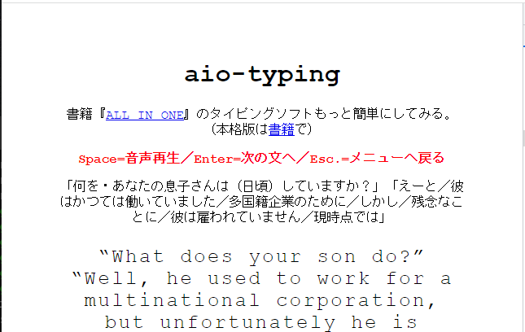

# aio-typing

## 概要
- 書籍『ALL IN ONE』のタイピング学習のレベルが高いので、易しいコンテンツを作成したい
  * フルスペックのソフトは、Linkage Club『[ALL IN ONE](https://linkage-club.net/books#all)』の書籍を参考にしてみてください
   + ALL IN ONE『[英語独学支援サイト](https://www.aio-english.net/)』

### 詳細
- コンテンツの利用方法（操作方法）
#### 利用方法

##### 01．トップメニュー

| キー | 機能 | 備考 |
| ---- | ---- | ---- |
| Enter | スタート | タイピングをスタート |

##### 02．タイピング中（スタート後）

| キー | 機能 | 備考 |
| ---- | ---- | ---- |
| `0-9a-z` | タイピング | 正解時に表示 |
| Space | 音声再生 | 先頭から再生 |
| Ctrl  | 音声一時停止 | 停止・再開 |
| Enter | 次の文へ | 答え表示(+音声再生)・次問題へ |
| BkSp. | もう一度 | 答え表示・次問題へ |
| Esc. | メニューへ戻る |   |

##### スナップショット

| 01．トップメニュー | 02．タイピング中 |
| ----- | ----- |
|  |  |

## 参考情報
- タイピングゲームは、ドットインストール『[JavaScriptでタイピングゲームを作ろう](https://dotinstall.com/lessons/typing_js_v4)』を参考にしました

## LICENSE
- MIT LICENSE

